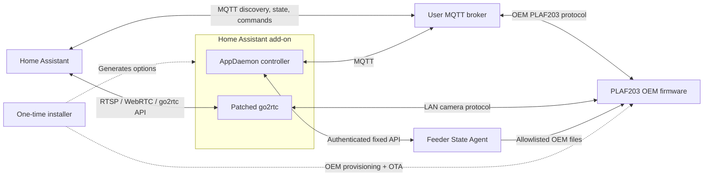

# Architecture

Petlibro Local keeps device bootstrap, feeder-resident state access, Home
Assistant control, and camera transport in separate trust and runtime domains.

## Component boundaries

### Unified installer

[`installer/`](../installer/README.md) is a setup-machine tool used once on a
stock, already claimed feeder. It captures the feeder's OEM broker identity,
checks the final broker, sends the one-time OEM OTA bootstrap, restores the OEM
firmware slots, redirects the feeder to the user's broker, and generates the
matching add-on options.

This is the only production component allowed to use the unauthenticated OEM
provisioning and OTA surfaces. Those capabilities do not exist in the installed
State Agent API.

### Feeder State Agent

[`state-agent/`](../state-agent/README.md) is a small C service running beside
the unchanged OEM firmware. It reads only fixed OEM state files, validates
their shape, and returns snapshot-consistent decoded state and revisions over
an authenticated source-IP-restricted HTTP API.

It also accepts one signed, fixed-format agent update upload. A runit supervisor
performs durable candidate activation, probation, and single-backup rollback.
There is no arbitrary file, path, command, shell, or package-management API.

### Home Assistant add-on

[`addon/`](../addon/README.md) packages two independent s6 services:

- the AppDaemon controller, which handles feeder MQTT, Home Assistant entity
  projection, State Agent reconciliation, and signed update orchestration;
- the go2rtc fork, which handles LAN camera discovery, Petlibro media transport,
  and standard streaming outputs.

Home Assistant options are rendered atomically into service configuration under
`/data`. s6 owns restart and shutdown behavior; neither application supervises
the other.

## State ownership

The integration distinguishes state by authority and lifetime.

| State | Authoritative source | Home Assistant behavior |
| --- | --- | --- |
| Persistent feeder settings | State Agent `/v1/core` | Reconciled and retained for presentation; writes require fresh verification |
| Feeding plans | State Agent `/v1/plans` | Complete-collection reconciliation and verification |
| Current dispensing state | Solicited `ATTR_GET_SERVICE.motorState`, then grain events | Non-retained, dedicated availability |
| Runtime telemetry | OEM MQTT events/attributes | Projected as live observations |
| Last feed observations | Completed grain-event sequence | Retained historical facts |
| Camera runtime | go2rtc status file | Validated and projected to MQTT |

The State Agent labels decoded core fields as:

- `persistent`: file-backed configuration suitable for command verification;
- `effective_cached`: firmware-computed cached state, informational only;
- `runtime`: opportunistically persisted telemetry/machine state.

An MQTT acknowledgment proves only that firmware accepted a command. The state
coordinator reads a new State Agent revision and verifies the requested value
before changing its model. If reconciliation fails, persistent controls become
unavailable rather than using retained Home Assistant values as feeder truth.

## Dispensing runtime ordering

At first heartbeat, feeder reconnect, and `homeassistant/status = online`, the
controller sends a correlated `ATTR_GET_SERVICE` request. Recognized live
`motorState` values map as follows:

- `1`: Dispensing;
- `2`: Idle;
- `3`: Recovering;
- `0`, malformed, unknown, or timeout: unavailable.

After bootstrap, `GRAIN_OUTPUT_EVENT` immediately drives Dispensing, Blocked,
and Idle transitions. Each runtime request records the feeder connection
generation, request `msgId`, and local grain-event generation. A response from
an old connection, for a different request, or overtaken by a newer grain event
cannot overwrite current state.

Raw motor GPIO is not used: the OEM state machine can intentionally stop the
motor during an active dual-bowl transition, so stopped pins do not prove Idle.
The file-backed `motor_state_raw` is also not current enough for this purpose.

`food_output/progress` and its availability topic are non-retained. The four
last-feed observations are retained because they describe completed history,
not current actuator state.

## Discovery and camera flow

The controller learns feeder serial/product identity from MQTT and camera UID
from `DEVICE_START_EVENT`. Device discovery resolves the current feeder address
using the UID-specific LAN_SEARCH3/KNOCK2 exchange and writes a private device
registry. Only resolved devices receive go2rtc stream entries.

The go2rtc `petlibro://` producer opens on demand. It performs the local camera
handshake, stream control, media-window acknowledgment, and H.264/AAC assembly.
It writes one private atomic status JSON file per stream. AppDaemon validates
that internal file and publishes the stable
[camera MQTT contract](mqtt-camera-contract.md); frontend consumers do not
depend on go2rtc internals.

## Network and security boundaries

- Host networking is required for LAN UDP discovery and practical WebRTC.
- Feeder MQTT uses a separate least-privilege broker identity from the add-on.
- The State Agent requires bearer authentication and a fixed source-IP ACL.
- State Agent updates require a pinned Ed25519 trust anchor and strict manifest.
- Camera and go2rtc listeners should remain on a trusted LAN.
- Installer temporary servers are source-restricted and short-lived.
- Secrets and generated bootstrap material are ignored and must not be logged.

The add-on's normal heartbeat does not involve the State Agent. OEM firmware
publishes the heartbeat through MQTT; the controller uses it as a connection
signal and separately queries the State Agent when persistent revisions need
reconciliation.

## Packaging and source ownership

All component sources are maintained directly in this repository; there are no
submodules or runtime references to archived development repositories. The
Home Assistant package is built from [`addon/Dockerfile`](../addon/Dockerfile).
The State Agent is cross-compiled into static ARMv7 hard-float binaries for the
installer payload. Development-only Compose files live under [`docker/`](../docker/README.md).

Raw captures, Ghidra projects, device dumps, and exploratory scripts are not
production dependencies and remain outside Git. Sanitized protocol fixtures and
maintenance guidance may be tracked when they directly protect implemented
behavior.
